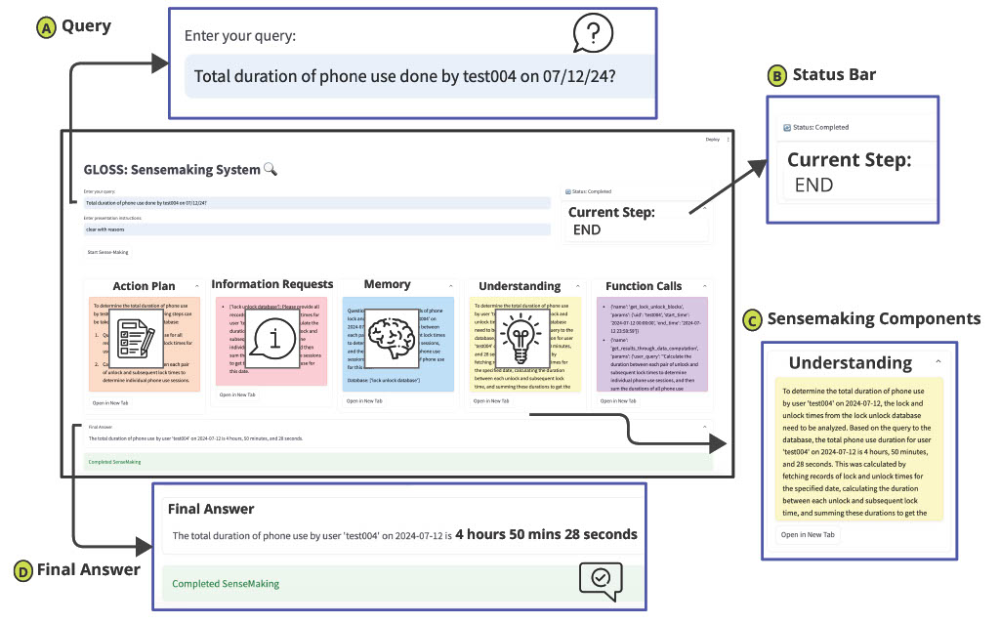

# GLOSS Setup Guide

This guide walks you through setting up GLOSS (Group of LLMs for Open-Ended Sensemaking) on your local machine. To read more about GLOSS, please refer to the 📚 [full paper for GLOSS](https://dl.acm.org/doi/10.1145/3749474).

## Prerequisites Setup

### 1. Install Required Software

- **Anaconda**: Download from [anaconda.com](https://anaconda.com) if not already installed
- **Docker**: Download from [docker.com](https://docker.com) if not already installed  
- **Git**: Most computers have this, but download from [git-scm.com](https://git-scm.com) if needed

## Getting the Code

### 2. Download the Repositories

Open your terminal/command prompt and navigate to your working directory 

```bash
# Clone the public github GLOSS repository
git clone https://github.com/UbiWell/GLOSS.git
# or using SSH:
# git clone git@github.com:UbiWell/GLOSS.git
```

Clone the stress detection algorithm inside the GLOSS repo. GLOSS uses stress detection models by  📚[Varun et al](https://pmc.ncbi.nlm.nih.gov/articles/PMC9523764/) to detect stress using IBI data

```bash
cd GLOSS

git clone https://github.com/UbiWell/stress-detection-algorithm-code-python.git
# or using SSH:
# git clone git@github.com:UbiWell/stress-detection-algorithm-code-python.git
```
Your folder structure should now look like:
Working dir/GLOSS/stress-detection-algorithm-code-python

***What this does:*** Downloads two code repositories needed for GLOSS to work properly.

## Setting Up Python Environment

### 3. Create the Conda Environment

```bash
# Go into the GLOSS repository if it's not your current directory
cd GLOSS

# Create a new Python environment (The default name is gloss-sensemaking)
conda env create -f environment.yml (OPTIONAL: -n preferred-env-name)

# Activate your new environment
conda activate gloss-sensemaking (or preferred-env-name)
```
***What this does:*** Creates an isolated Python environment with all the right packages so GLOSS works correctly.

### 4. Setting up Config and ENV variables
Go to `agents/config.py` and set up config variables. By default, GLOSS uses GPT-4o:

```bash
USE_AZURE = False #(True if using Azure deployment)
USE_GPT5 = False #(True if using GPT-5)
ONLY_CODE_FUNCTIONS = True #(True if all runs use code generation)
VERBOSE = True #(True if need more verbosity when running sensemaking_process.py)
USE_CSV = True #(True if using CSV as data, keep it true as demo uses csv data)
DOCKER_NAME = "gloss-sensemaking-code" # (name of Docker to run LLM-generated code)
```

#### Set ENV variables:
OPENAI_API_KEY or AZURE_OPENAI_API_ENDPOINT and AZURE_OPENAI_API_KEY based on whether you are calling OpenAI APIs directly or through Azure deployment.

***Example***
```bash
export AZURE_OPENAI_API_KEY="your_api_key_here"
Save and reload your shell:

source ~/.bashrc   # or ~/.zshrc
```
## Docker Setup

### 5. Add Your API Keys
* **Open the Dockerfile in the llm-sensemaking folder**
* **Find the environment variables section**
* **Replace the placeholder values with your actual API keys (OpenAI, Claude, etc.)**

### 6. Build the Docker Container
```bash
# From the GLOSS dir, build the Docker image  (this may take a few minutes)
docker build -f Dockerfile -t gloss-sensemaking-code . # (use the name set up in config)
```
***What this does:*** Creates a containerized environment that packages everything GLOSS needs to run consistently.

## Running GLOSS
### 7. Sample Data
The first author provided one day (08/28/2025) of their data as sample data, except location database in CSV Format. 
So after setting up GLOSS, users can query the data.

### 8. Customize and Run
```bash
# Edit the main script to set your research question
vi sensemaking_process.py  # or use your preferred editor
```
```python
# Change presentation instructions and query to run:
# Example shown below
presentation_instructions_ = '''
clear and concise
'''
query = '''
on aug 28 2025, for test004 what was most used app by duration?'''
SenseMaker(
   query,
   presentation_instructions_).make_sense(verbose=VERBOSE)
```

```bash
# Run GLOSS!
python sensemaking_process.py
```
***What this does:*** Starts the sensemaking process with your custom query.

GLOSS runs the sensemaking process and you can see every step of the process and the final answer.

### 9. You can also use GLOSS UI for running queries
 ```bash streamlit run sensemaking.ui ```

 [ Figure 1: Sensemaking Process ](images/sensemaking_ui.jpg)

## Adding your own database
#### 1. Copy the template:
   ```bash
   cp data_streams/database_template.py data_streams/my_new_database.py
   ```
#### 2. Uncomment the code as code in my_new_database.py is commented. Fill in the metadata:
   ```python
   database_info = {
       "name": "my_new_database", 
       "info": "Description of your database",
       "device": "Phone",  # or "Watch", "Sensor", etc.
       "additional_instructions": "Any special instructions"
   }
   ```

#### 3. Add function metadata for LLMs:
   ```python
   functions = {
       "FUNC1": {
           "name": "get_my_data",
           "description": "Retrieves data from your database",
           "usecase": ["code_generation", "function_calling"],
           "params": {
               "user_id": {"type": "str", "description": "User identifier"},
               "start_time": {"type": "str", "description": "Start time"},
               "end_time": {"type": "str", "description": "End time"}
           },
           "returns": "A list of data records",
           "example": "[{'timestamp': '2024-01-01 12:00:00', 'value': 42.5}]"
       }
   }
   ```

#### 4. Add your actual function implementations:
   ```python
   def get_my_data(user_id: str, start_time: str, end_time: str):
       # Your implementation here
       pass
   
   function_refs = {
       "get_my_data": get_my_data
       # Add more functions
   }
   ```

#### 5. That's it! The registry will automatically discover and load your new database.

   ```python
   database_info = {
       "name": "my_new_database", 
       "info": "Description of your database",
       "device": "Phone",  # or "Watch", "Sensor", etc.
       "additional_instructions": "Any special instructions"
   }
   ```

#### If you use this code please cite:
***Akshat Choube, Ha Le, Jiachen Li, Kaixin Ji, Vedant Das Swain, and Varun Mishra. 2025. GLOSS: Group of LLMs for Open-ended Sensemaking of Passive Sensing Data for Health and Wellbeing. Proc. ACM Interact. Mob. Wearable Ubiquitous Technol. 9, 3, Article 76 (September 2025), 32 pages. https://doi.org/10.1145/3749474***


**Feel free to open issues in the repository or contact choube.a@northeastern.edu if you need additional help setting up GLOSS locally.**